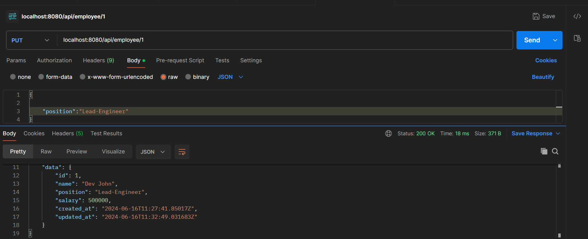

# Employee Management System
This Employee Management System is completely written in Go language having a postgres database along with the Clean Architecture.
### Pre-requisites

#### To insert the table in the postgres database, run the below make command
```
make db-migrateup
```

### How to run

```
go run cmd/server/main.go
```

### Example Api's 

#### 1. Add New Employee
 ```
 curl --location 'localhost:8080/api/add-employee' \
--header 'Content-Type: application/json' \
--data '{
    "name":"Dev John",
    "position":"Engineer",
    "salary":500000
}'
 ```
 Output 
 ```
 {
    "header": {
        "total_data": 1,
        "process_time": 0.04709128,
        "meta": null
    },
    "status": {
        "error_code": 0,
        "message": "OK"
    },
    "data": {
        "id": 1
    }
}
 ```
 

#### 2. Get Employee By ID
```
curl --location 'localhost:8080/api/employee/1'
```
Output


#### 3. Update Employee 
 ```
 curl --location --request PUT 'localhost:8080/api/employee/1' \
--header 'Content-Type: application/json' \
--data '{

    "position":"Lead-Engineer"
}'
 ```

Output


#### 4. Delete Employee
 ```
 curl --location --request DELETE 'localhost:8080/api/employee/1'
 ```

 Output
 

#### 4. List Employee Along With pagination

```
curl --location 'localhost:8080/api/list_employee?page=3&page_size=5'
```

Output 
```
{
    "header": {
        "total_data": 1,
        "process_time": 0.002871469,
        "meta": null
    },
    "status": {
        "error_code": 0,
        "message": "OK"
    },
    "data": [
        {
            "id": 12,
            "name": "Linda Thompson",
            "position": "HR Manager",
            "salary": 72000,
            "created_at": "2024-06-16T11:36:17.864376Z",
            "updated_at": "2024-06-16T11:36:17.864376Z"
        },
        {
            "id": 13,
            "name": "Thomas Garcia",
            "position": "Database Administrator",
            "salary": 90000,
            "created_at": "2024-06-16T11:36:17.864376Z",
            "updated_at": "2024-06-16T11:36:17.864376Z"
        },
        {
            "id": 14,
            "name": "Barbara Rodriguez",
            "position": "Front-end Developer",
            "salary": 78000,
            "created_at": "2024-06-16T11:36:17.864376Z",
            "updated_at": "2024-06-16T11:36:17.864376Z"
        },
        {
            "id": 15,
            "name": "William Martinez",
            "position": "Back-end Developer",
            "salary": 89000,
            "created_at": "2024-06-16T11:36:17.864376Z",
            "updated_at": "2024-06-16T11:36:17.864376Z"
        },
        {
            "id": 16,
            "name": "Jessica Hernandez",
            "position": "QA Engineer",
            "salary": 74000,
            "created_at": "2024-06-16T11:36:17.864376Z",
            "updated_at": "2024-06-16T11:36:17.864376Z"
        }
    ]
}
```
